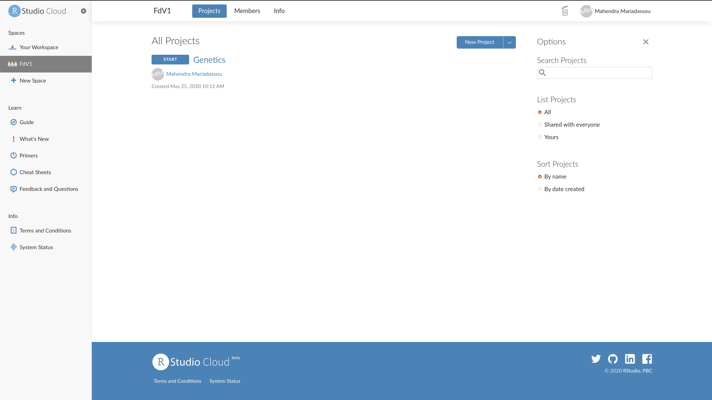
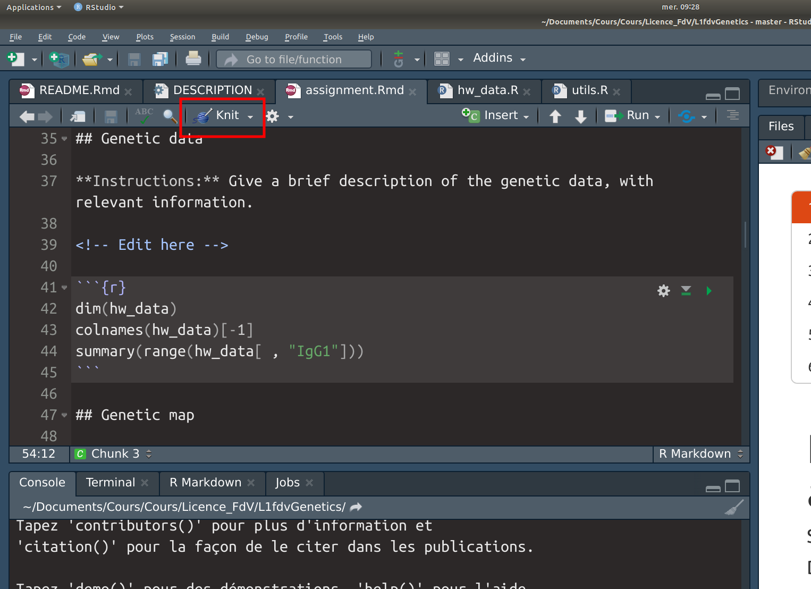
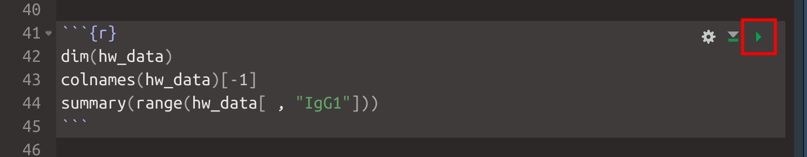

<!-- README.md is generated from README.Rmd. Please edit that file -->

```{r, include = FALSE}
knitr::opts_chunk$set(
  collapse = TRUE,
  comment = "#>",
  fig.path = "man/figures/README-",
  out.width = "100%"
)
```

# L1fdvGenetics

<!-- badges: start -->
<!-- badges: end -->

The goal of `L1fdvGenetics` is to provide interactive tutorials for the Genetics project. Tutorials are packaged so you can install them on you computer and do the exercices without access to an internet connection. 

## Installation

### Local installation

You only need to perform each of the following steps **once**:

- installing **R** 
- installing **Rstudio**
- installing **R** packages `remotes` and `learnr`

However each of them may take some time. 

#### Installing R

Go to the CRAN [webpage](https://cran.r-project.org/), select your OS and follow the instructions. 

- On Windows, you should just download and execute an .exe file. 
- On MacOS, you should just download and execute a .pkg file. 
- On Linux, you can get install R from the command line using something like

```{bash, eval = FALSE}
## If you're on Ubuntu
sudo apt-get install r-base
```

On **Windows**: you may need **Rtools** (unlikely) and **git** 

- **Rtools**: visit the dedicated [page](https://cran.r-project.org/bin/windows/Rtools/), download the suggested exe and install it on your computer
- **git**: visit the dedicated [page](https://git-scm.com/download/win), download the suggested exe and install it on your computer


On **MacOS**: you may need **XCode** (unlikely)

- **XCode**: visit the dedicated [page](https://mac.r-project.org/tools/), download the **Mandatory tools** and install them on your computer

#### Installing RStudio Desktop

Go to the [download](https://rstudio.com/products/rstudio/download/#download) page. Select, download and install the file corresponding to your OS. 

#### Installing R packages

Launch Rstudio (by clicking on the corresponding icon) and execute the following commands in the console
```{r eval = FALSE}
install.packages("remotes") 
install.packages("learnr") 
```

#### Installation (II)

You need to install the tutorials **every time** I update them (hopefully not too often). 

### Installing the tutorials

You can install the tutorials from [GitHub](https://github.com/) by launching Rstudio and typing the following command in the console:

```r
remotes::install_github("mahendra-mariadassou/L1fdvGenetics")
```

The tutorials included in `L1fdvGenetics` are lightweight and have no dependencies. It should be quite fast and not consume a lot of data. 

### Remote installation: Rstudio Cloud

If you have trouble installing R on your computer, you can also use it on a remote server. **This is not the preferred solution as it's limited to 9 people**. Favor the local installation if you can. 

- Sign up on [Rstudio Cloud](https://rstudio.cloud/)
- Join the [Genetics project](https://rstudio.cloud/spaces/71850/join?access_code=Ojh4cBY8MsdNd44weVIZ6u5txVALu8l8wLriT99k)
- Choose 'Join Space'
- Choose 'Projects' and select 'Start' (blue buttons)

- Rstudio deploys the project on a remote server, **you don't need to install anything else**
- You can then start the tutorial as shown below

### Remote installation: binder

Alternatively, you can use create a remote R session to complete the tutorial by launching binder:  [](https://mybinder.org/v2/gh/mahendra-mariadassou/L1fdvGenetics/master?urlpath=rstudio)

You only need a web browser, no account or anything. The main drawback of this solution (compared to the previous ones) is that you lose your progress each time you launch a new session. 

## Starting a tutorial

This package is intended for use with `learnr` (which should be installed when you install `L1fdvGenetics`). 

There are two tutorials in the package. Make sure to restart R before running a tutorial. **Don't run a tutorial twice (or two different tutorials) in the same R session.**

### Candidate gene (single marker) approach

```{r simple_marker, eval = FALSE}
## Launch only one tutorial at the time and restart R before doing so!!
learnr::run_tutorial("01_candidate_gene", package = "L1fdvGenetics")
```

If you have an error, you can try the following command:
```{r, eval =FALSE}
rmarkdown::run(file = NULL, 
               dir = learnr:::get_tutorial_path("01_candidate_gene",  
                                                package = "L1fdvGenetics"), 
               shiny_args = list(launch.browser = 1))
```

### QTL detection by Simple Interval Mapping (SIM)

```{r sim, eval = FALSE}
## Launch only one tutorial at the time and restart R before doing so!!
learnr::run_tutorial("02_interval_mapping", package = "L1fdvGenetics")
```

If you have an error, you can try the following command:

```{r eval = FALSE}
rmarkdown::run(file = NULL, 
               dir = learnr:::get_tutorial_path("02_interval_mapping",  
                                                package = "L1fdvGenetics"), 
               shiny_args = list(launch.browser = 1))
```


## Assignement 

You can open the (empty) assignment template with:
```{r, eval = FALSE}
file.edit(system.file("assignment/assignment.Rmd", package = "L1fdvGenetics"))
```

Or [download](https://raw.githubusercontent.com/mahendra-mariadassou/L1fdvGenetics/master/inst/assignment/assignment.Rmd) it from the web. 

**Make a copy and save it on your computer** (you can edit the file you just opened but you can't save it). 

This is an Rmd (similar to a jupyter notebook). You can write R code in **code chuncks** (you shoudn't have to, unless you attempt to detect QTL in Chromosome 2). 


You should **knit** the document to an html file once to get the raw results. You can do so by clicking on the knit button. 



You can also execute each chunck in the console using the small green triangle (note that you should execute chuncks in turn as a chunck may depend on previous chuncks). 



When you're done adding comments and editing the document (for example, hiding some output from the final reports), you should knit it to a html file and submit it to moodle or through a google form (further instructions will follow). 
